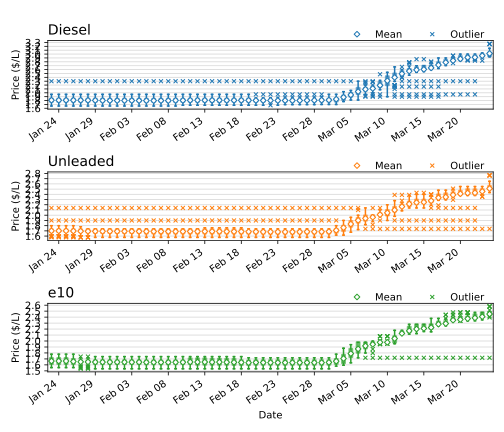

# Cairns Fuel Price Monitor

A personal playground for experimenting with database deployments and automating data visualization using GitHub Actions.

---

## 📊 Live Price Trends (past 30 Days)
This chart is automatically generated every day at **9am, 2pm, and 7pm AEST**.

---
